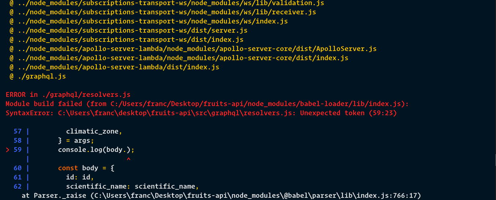
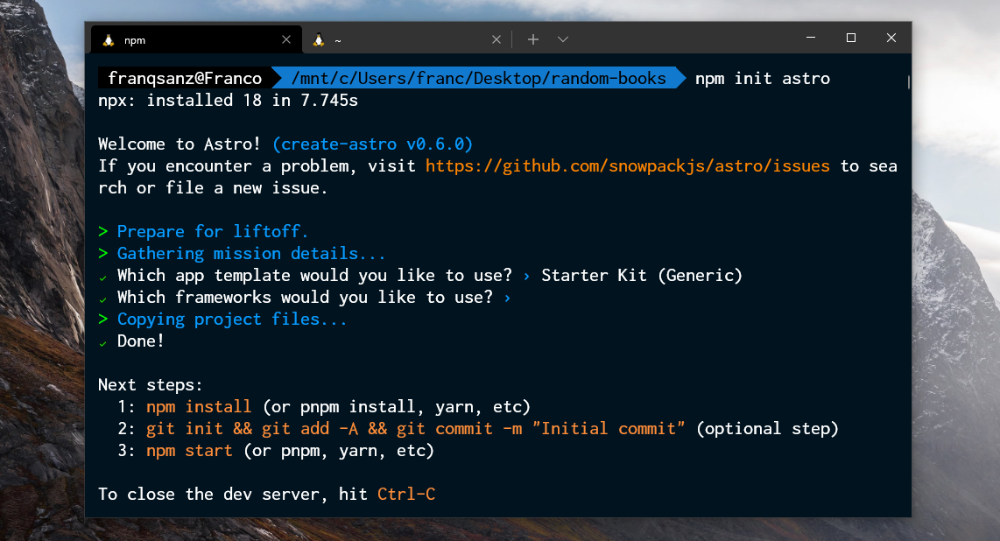
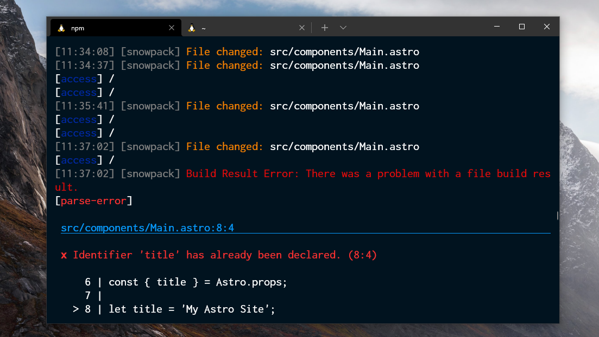

# Alive for [Windows Terminal](https://github.com/microsoft/terminal)
🎨 Mi tema oscuro para Windows Terminal.





### Descarga
Descargue el repositorio comprimido desde aquí o copié el esquema.

### Instalación
Pegue en `schemes` el `alive.json` en su configuración de Windows Terminal. Para abrir la configuración presioné `Ctrl + ,`, esto le abrirá el `settings.json`.

Ejemplo:

```json
"schemes": [
  {
    "name": "Alive",
    "cursorColor": "#FFC700",
    "selectionBackground": "#44475A",
    "background": "#011422",
    "foreground": "#E3E3E3",
    "black": "#1A1A1A",
    "blue": "#127ACE",
    "cyan": "#FF6800",
    "green": "#00ff00",
    "purple": "#FF79C6",
    "red": "#BF0505",
    "white": "#F8F8F2",
    "yellow": "#FFC700",
    "brightBlack": "#3A66FF",
    "brightBlue": "#DD23C8",
    "brightCyan": "#A4FFFF",
    "brightGreen": "#00FF00",
    "brightPurple": "#FF00FF",
    "brightRed": "#FF2525",
    "brightWhite": "#FFFFFF",
    "brightYellow": "#FCC700"
  }
]
```

### Activar
Solo debe colocar el nombre del `schemes` en los `profiles`.

Ejemplo:

```json
{
  "profiles": [
    {
      "colorScheme": "Alive",
    }
  ]
}
```

### Recomendación
Recomiendo las siguientes opciones de configuración para el terminal, esta es mí preferencia personal pero quizás te guste.

```json
{
  "profiles": [
    {
      "colorScheme": "Alive",
      "cursorShape": "filledBox",
      "fontFace": "operator mono",
      "fontSize": 15,
      "padding": "15, 0, 0, 0",
    }
  ]
}
```