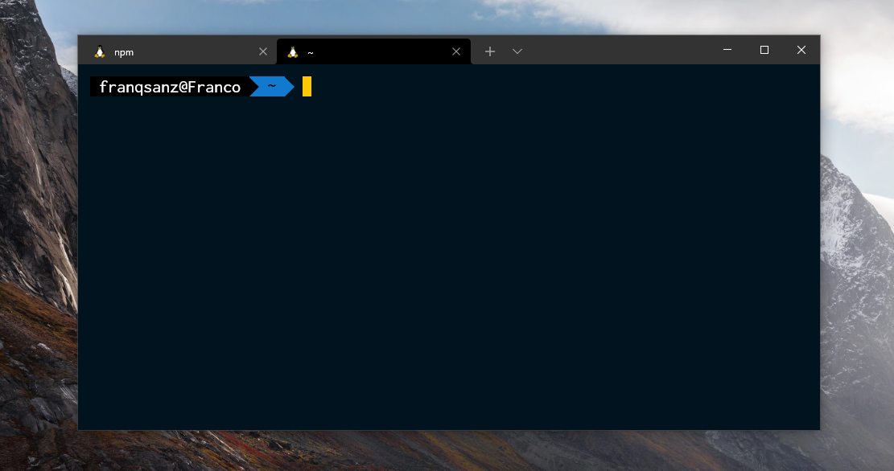
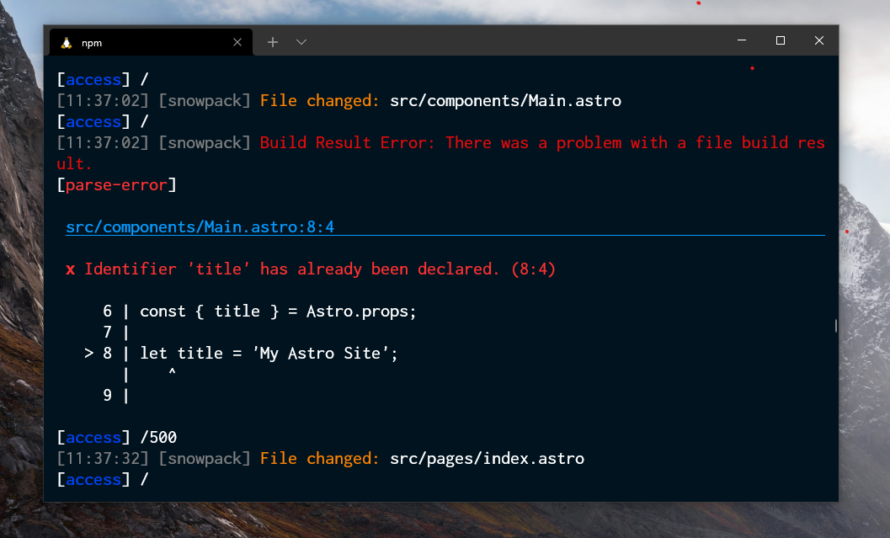
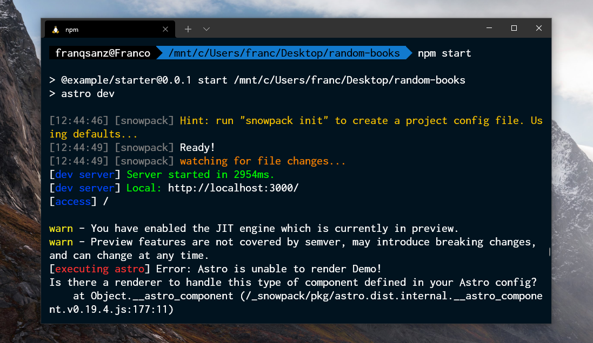

# Alive for [Windows Terminal](https://github.com/microsoft/terminal)
 🎨 Mi tema oscuro para Windows Terminal. Inspirado en el tema Dracula y Cobalt2.






### Descarga
Descargue el repositorio comprimido desde aquí o copié el esquema.

### Instalación
Pegue en `schemes` el `alive.json` en su configuración de Windows Terminal. Para abrir la configuración presioné `Ctrl + ,` o presione en abrir una nueva pestaña y luego navegue hasta "Configuración"

Esto le abrirá lo siguiente:

Luego navegue hasta "Combinaciones de colores"


## Esquema de colores

```json
"schemes": [
  {
    "name": "Alive",
    "background": "#01131F",
    "black": "#000000",
    "blue": "#127ACE",
    "brightBlack": "#079BFF",
    "brightBlue": "#0028A3",
    "brightCyan": "#FF8D39",
    "brightGreen": "#00AD00",
    "brightPurple": "#FF00FF",
    "brightRed": "#FF3131",
    "brightWhite": "#FFFFFF",
    "brightYellow": "#FFC700",
    "cursorColor": "#FFC700",
    "cyan": "#FF8400",
    "foreground": "#FFFFFF",
    "green": "#00FF00",
    "purple": "#FF0082",
    "red": "#E30B0B",
    "white": "#FFFFFF",
    "yellow": "#FFC700",
    "selectionBackground": "#000000"
  }
]
```

### Activar desde el JSON
Solo debe colocar el nombre del `schemes` en los `profiles`.

Ejemplo:

```json
{
  "profiles": [
    {
      "colorScheme": "Alive",
    }
  ]
}
```

### Recomendación
Esta es mí preferencia personal pero quizás te guste.

```json
{
  "profiles": [
    {
      "colorScheme": "Alive",
      "cursorShape": "filledBox",
      "fontFace": "Inconsolata for Powerline",
      "fontSize": 16,
      "padding": "15, 15, 0, 15",
    }
  ]
}
```

### Fuentes que te pueden gustar

* MesloLGS NF
* Cascadia Code PL
* Inconsolata for Powerline